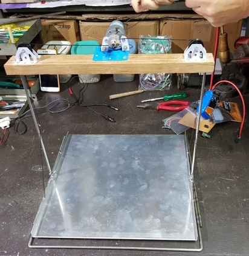
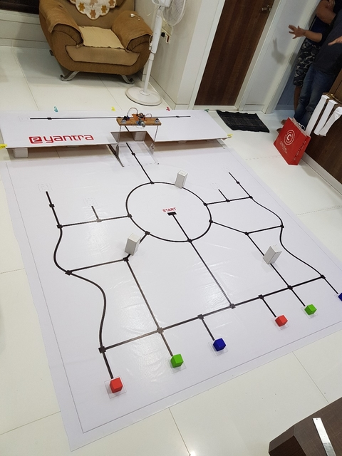
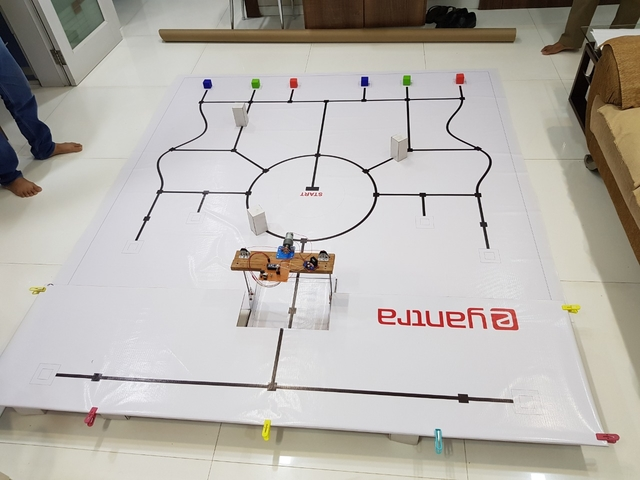
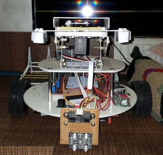
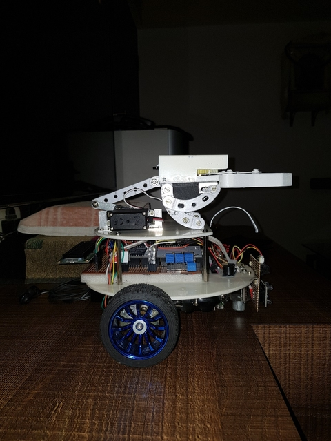
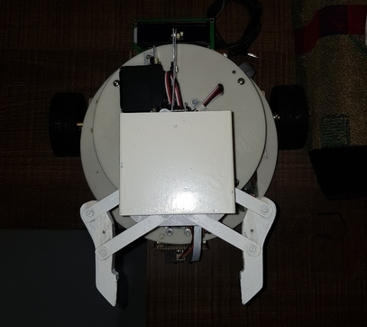

# E-Yantra Robotics Competition 2018 from IIT-Bombay - NUTTY SQUIRREL

e-Yantra Robotics Competition (eYRC) is a unique annual competition launched in the month of August every year for undergraduate students in science and engineering colleges, polytechnic. Sponsored by MHRD under the National Mission on Education through ICT program. National level competition organised by the government

## PROBLEM STATEMENT

Forests cover 31 percent of earth’s land and is home for all the plants and animals. These plants and animals are integral to forest ecosystems and provide countless benefits to humans.

If we talk about a single animal say Squirrel and its lifestyle, in the last few decades, numerous studies and scientific publications have confirmed the fact that squirrels have a significant positive effect on seed dispersal and subsequently forest regeneration.

Squirrels know when winter is arriving and start searching for food. They gather all the nuts they can during the fall and save them for future. They dig holes and bury the nuts close to their nests so that other squirrels can’t steal them. When they are hungry, they use their strong sense of smell to identify the nuts they have buried. A study from University of California at Berkeley 2017 claims that tree squirrels use a mnemonic technique called "spatial chunking" to sort out and bury their nut scores by size, type, and perhaps nutritional value and taste.

How about depicting the behaviour of Squirrel through a robotic platform? Inspired by this idea, e-Yantra Robotics Competition (eYRC-2018) introduces “Nutty Squirrel”, a theme depicting a robot mimicking the behaviour of a Squirrel storing Nuts in different places.

In this theme, a robot and a lift mechanism is designed that depicts a Squirrel that sorts, carries and places nuts at different places on land and in trees. The challenges in this theme includes V-REP Simulation, Path Planning, building a Robot and Lift Mechanism, Sensor Interfacing, designing a mechanism to pick and place the Nuts. A configuration image will be given to teams. The arena consists of thermocol blocks of different colors that are placed randomly. The robot traverses the arena to pick up a block and place it at a designated section S1 and S2. The teams needs to make a lift mechanism to carry the bot at a certain height to place blocks at the designated section S3.

The challenge is to complete this task in the shortest time possible and place the blocks at designated sections.

## FILE STRUCTURE

```
.
├── assets
├── Final Code
    ├── .vs
    └── Final Code
        ├── lcd.c/ -> Interfacing with lcd and display of desired output
        └── logic.c  -> Path travesal logic, Interfacing of line sensor, color sensor, motor and servo motor
├── Hardware Testing/ -> Frontend for the project
├── linux_firebird/ -> Django app for endpoints
├── Resources -> Project configurations
├── Submissions
└── Tasks
├── README.md
└── rulebook_ns.pdf
```


## DEVELOPERS

> Rashmil Panchani
> [github.com/Rashmil-1999](https://github.com/Rashmil-1999)

> Parag Vaid
> [github.com/parag1999](https://github.com/parag1999)

> Preet Shah
> [github.com/preet4737](https://github.com/preet4737)

> Palash Rathod
> [github.com/palash27](https://github.com/palash27)


## IMPLEMENTATION

- ### LIFT AND ARENA
    A lift is built to take the bot from level 0 to level 1 of Arena and vice versa the lift is built using arduino nano, a motor and a proximity sensor was used for the detection of bot and code is written in embedded c.
    The Arena is made up of flex sheet with the path in the form of black lines and red, green and blue colored boxes acting as "Nuts" for the bot (Squirrel). The white boxes acts as an obstacle.

    

    

    

- ### BOT
    The bot is built on atmega256 using V-REP for simulations and embedded C for all the interfacing of sensors. The sensors included a white line black line sensor which is used for tracking the black colored path, it also consists of a rgb color sensor which is used for detecting the color of the block the bot was travelling to, it also has a proximity sensor for obstacle detection.
    After detecting the correct block, a picking and releasing mechanism is built using a servo motor for the bot to pick the block from the picking point and release it at the target point.
    The whole path is mapped and path planning is performed using Djikstra’s shortest path planning algorithm and also has support to find a new shortest path after obstacle detection.

    

    

    